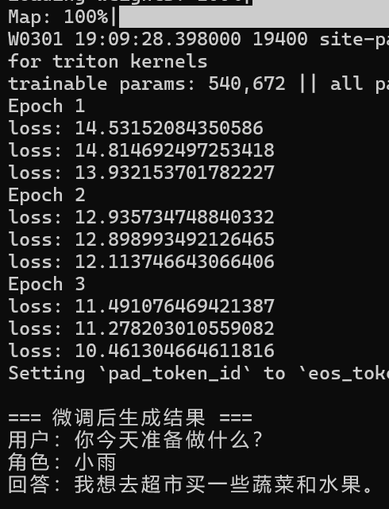

本周我主要实践了 LoRA 微调大模型，并完成了一个游戏角色对话任务。
在实验过程中，我也遇到了一些实际问题。例如最初尝试使用 4bit 量化 来进一步减少显存占用，但由于硬件与 CUDA 兼容问题，本机无法正常运行，因此改用 FP16 方案。在数据规模较小的情况下，模型的 loss 会下降较快，但生成效果仍然依赖 Prompt 的设计，这让我意识到 Prompt Engineering 在大模型应用中的重要作用。
在实践中，我主要做了：
加载预训练模型和 tokenizer
配置 LoRA，只训练少量权重
使用 FP16 精度训练，降低显存占用
设计 Prompt 模板，引导模型生成符合角色设定的回答
训练循环和生成推理，观察 loss 下降和输出变化
通过实验，我理解到：
LoRA 只调整少量参数，可以在显存有限的条件下微调大模型
FP16 精度足够训练和推理，同时减少显存占用
Prompt 的设计对生成质量影响很大，输入格式直接决定角色语气和行为

在实践过程中，我遇到几个问题：
显存不足，4bit 量化无法在本机运行，改用 FP16 后正常
数据量小，loss 下降很快，但生成结果仍需调 Prompt
输出偶尔不稳定，需要增加训练轮次和调整 Prompt

通过这次实验，我认识到：
LoRA 的优势：快速适配大模型，显存需求低
预训练模型的优势：大模型已学到通用知识，微调只需少量数据即可实现定制任务
Prompt 设计的重要性：输入格式直接影响输出质量
训练与推理结合观察，更直观理解模型学习过程
